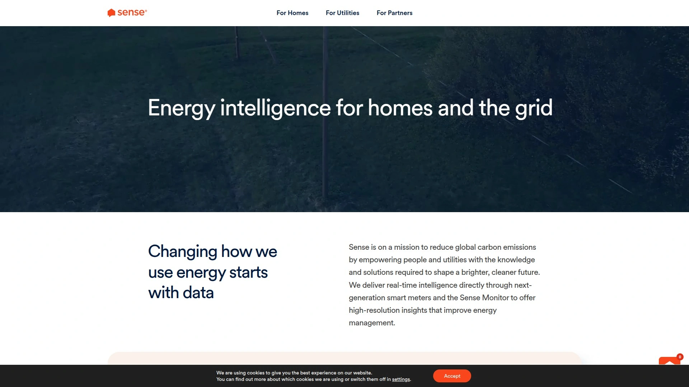

# No More Confusing Power Bills! Recommend 7 Money-Saving Game-Changers

Electricity bills keep climbing while you sit in the dark trying to figure out which mystery charges are legitimate and which appliances secretly drain your wallet every month. Energy savings apps solve this by monitoring real-time usage, identifying power-hungry devices, switching you to better rates, and rewarding reduced consumption—so you can slash bills by hundreds of dollars annually without becoming an energy expert or manually tracking every watt.

***

## **[Arbor](https://www.joinarbor.com)**

Direct electricity bill reduction app saving Americans money through rate optimization and usage insights.

Arbor simplifies the overwhelming complexity of power bills by directly lowering what everyday Americans pay for energy, allowing more resources for what actually matters in life. The platform cuts through the confusing maze of hidden fees, unclear pricing tiers, and deliberately opaque utility structures that make comparing options nearly impossible. According to recent research, cost savings drives energy reduction for over 60% of Americans, with only 18% prioritizing sustainability—Arbor meets users where they are by focusing on dollars saved first.

The app tackles heat pump adoption barriers by demonstrating potential 60% reductions in electricity use compared to furnaces or baseboard heaters, translating massive yearly savings into concrete dollar amounts households can actually visualize. Rather than requiring extensive hardware installation or technical knowledge, Arbor operates primarily through smart rate analysis and behavioral insights accessible via smartphone. The company secured seed funding to expand environmental solutions while keeping them financially accessible to broader audiences beyond affluent early adopters.

For households frustrated by rising electricity costs and utility company runarounds, Arbor delivers straightforward savings through technology requiring minimal user effort. The platform works particularly well for renters and homeowners unable to make major infrastructure investments but wanting immediate bill reductions. By prioritizing financial relief over environmental virtue signaling, Arbor appeals to the vast majority of Americans seeking practical solutions to climbing energy expenses.

---

## **[OhmConnect](https://www.ohmconnect.com)**

California-focused energy rewards program paying users for reducing consumption during peak pricing periods.

OhmConnect operates as both an energy management program and retail electricity provider in Texas, creating a dual approach to lowering bills. The California program alerts participants via email and SMS approximately once weekly when electricity prices spike during peak demand, encouraging temporary usage reduction. Users who successfully decrease consumption during these "OhmHours" earn rewards redeemable for gift cards, PayPal cash, or entries into prize drawings including trips and major appliances. The collective savings from all participants gets aggregated and sold back to California's grid operator, funding the rewards program.

Smart home integration amplifies savings by automatically powering down connected thermostats, smart plugs, and other devices during expensive peak periods without requiring manual intervention. The Texas electricity offering combines affordable locked-in rates with exclusive rewards—the more energy saved, the more earned. Free enrollment removes barriers to entry, with users only needing to connect utility accounts for tracking. Support team assistance via email helps navigate app features and reward redemption.

The community-driven approach creates environmental benefits by reducing grid strain during high-demand periods, potentially keeping dirty backup power plants offline while improving neighborhood air quality. OhmConnect serves California residents seeking both bill savings and rewards for conservation efforts, plus Texans wanting electricity plans that actively reward efficiency rather than penalizing it. The program works best for households with flexible energy usage patterns and smart device ecosystems enabling automated participation.

***

## **[Energy Ogre](https://www.energyogre.com)**

Texas electricity concierge service finding optimal plans among thousands of options for $10 monthly.

Energy Ogre functions as a fearless consumer advocate with zero financial ties to retail electricity providers, ensuring completely unbiased plan recommendations based purely on customer savings potential. The service evaluates over 1,000 electricity plans from 100+ providers continuously, checking rates every 15 minutes year-round to identify opportunities traditional shoppers miss. This constant monitoring uncovers exclusive plans unavailable on public comparison sites like Power to Choose, giving members access to hidden deals.

The $10 monthly subscription covers complete electricity management from initial plan selection through enrollment, ongoing monitoring, issue resolution with providers, and automatic switching when better options emerge. Energy Ogre compares historical household usage against currently available plans, cross-referencing consumption patterns to predict actual costs rather than relying on advertised rates that hide fees. The service handles autopay setup, customer service interactions with multiple providers, and all administrative burdens—members simply enjoy savings averaging 40% without lifting a finger.

For Texans overwhelmed by deregulated electricity market complexity, Energy Ogre eliminates decision fatigue and ensures continuous optimization. The hands-off approach suits busy professionals, elderly residents struggling with comparison shopping, and anyone frustrated by variable rates that spike unexpectedly. However, the service exclusively serves Texas ERCOT territory, leaving residents of other states needing alternative solutions. Those comfortable navigating Power to Choose independently may find the subscription unnecessary, but most users report time savings and superior results justify the modest monthly fee.

***

## **[Arcadia](https://www.arcadia.com)**

Enterprise clean energy platform connecting businesses to utility data, procurement, and sustainability reporting.

Arcadia delivers end-to-end energy management solutions for businesses through AI-powered tools, deep industry expertise, and an expansive partner network. The platform consolidates fragmented utility data from thousands of providers across 50+ countries into a single source of truth, with 95% coverage of US utility accounts. This comprehensive access enables seamless energy usage monitoring, cost tracking, and optimization across entire organizational footprints. Advanced analytics transform raw utility data into actionable intelligence driving better decisions.

Utility Bill Management features automate payment processing, proactively identify billing errors, optimize tariff structures, and provide budgeting forecasts that lower costs and streamline administration. Energy Procurement Advisory helps source clean energy through comprehensive evaluation of onsite and offsite supply options, managing risks while reducing expenses and achieving corporate sustainability goals. Sustainability Reporting capabilities ensure compliance with carbon reduction commitments through standardized energy data feeding seamlessly into leading ESG platforms.

While powerful for enterprises managing complex multi-site energy portfolios, Arcadia targets businesses rather than individual consumers seeking household bill reductions. Large corporations, universities, government agencies, and organizations with ambitious sustainability mandates benefit most from the sophisticated data infrastructure and procurement expertise. Pricing operates on enterprise sales model rather than consumer subscription, positioning Arcadia as a B2B solution despite tangential residential offerings through community solar programs that have drawn skepticism from some users.

***

## **[Sense](https://sense.com)**

Real-time home energy monitoring system using machine learning to identify individual appliance consumption.

Sense empowers homeowners to use energy more efficiently by providing unprecedented visibility into exactly where electricity goes within homes. The system requires installing a monitoring device connecting to electrical panels, then uses machine learning algorithms to identify individual appliances based on their unique electrical signatures. Within weeks, Sense automatically detects when specific devices turn on and off, revealing energy hogs consuming power even during standby. Users save an average 8% on electric bills after gaining these insights.

Real-time notifications alert homeowners to unexpected behavior—forgot to turn off the oven? Sense notifies you. Concerned about sump pump failure during heavy rain? Get instant alerts if it stops running. This monitoring capability provides peace of mind that homes function properly even when occupants are away. The mobile app displays current consumption, compares usage to previous months, identifies inefficient appliances nearing replacement time, and offers personalized tips for reducing waste based on detected patterns.

The hardware investment ranges around $300 for the Sense Energy Monitor, representing higher upfront costs than app-only solutions but delivering granular insights those alternatives cannot match. Installation requires basic electrical knowledge or professional help, creating a barrier compared to plug-and-play apps. However, homeowners committed to long-term energy optimization and smart home integration find Sense's device-level visibility invaluable for maximizing efficiency. The system integrates with solar panels, EV chargers, and smart home ecosystems, making it ideal for tech-forward households wanting comprehensive energy intelligence.

---

## **[Loop](https://loop.homes)**

Free energy-saving app helping households track consumption and reduce bills through behavioral insights.

Loop provides a completely free platform for lowering electricity bills through awareness and behavior change rather than hardware requirements or subscription fees. The app connects to smart meters or utility accounts, displaying energy usage patterns and offering personalized recommendations for reducing consumption. By making energy data accessible and understandable, Loop helps households identify opportunities for savings without requiring technical expertise or significant investments in new equipment.

The platform focuses on actionable insights tailored to individual consumption patterns, suggesting specific times to run major appliances or highlighting periods of unexpectedly high usage warranting investigation. Gamification elements and progress tracking maintain engagement, turning energy reduction into an achievable goal rather than abstract environmental duty. Community features allow comparing consumption to similar households, providing context and motivation through friendly competition.

As a free offering without hardware dependencies, Loop removes financial barriers preventing many households from accessing energy management tools. The app works best for users with smart meters or utility accounts supporting data sharing, which limits availability in some regions. While lacking the device-level granularity of hardware monitors like Sense, Loop's zero-cost entry point makes it accessible to renters, budget-conscious families, and anyone wanting to experiment with energy tracking before committing to paid solutions or equipment purchases.

---

## **[Bidgely](https://www.bidgely.com)**

Enterprise energy analytics platform using AI to power utility customer engagement and efficiency programs.

Bidgely operates primarily in the B2B space, providing UtilityAI™ technology that helps electricity providers deliver better customer experiences through personalized energy insights. The platform powers Home Energy Reports that utilities send to customers, breaking down consumption by appliance category and offering tailored efficiency recommendations. Utilities use Bidgely's analytics to reduce call center volume, increase program enrollment, and help customers understand bills without overwhelming support teams.

Advanced AI capabilities analyze energy usage patterns to predict customer needs, identify efficiency opportunities, and create targeted messaging driving behavior change at scale. Salesforce integration enables utility customer service representatives to access detailed energy profiles during interactions, resolving issues faster and recommending appropriate programs. Recent GenAI enhancements make the platform even more intelligent at natural language processing and predictive insights.

While Bidgely's technology ultimately benefits consumers through utility programs, individual households cannot directly access the platform—it operates exclusively through utility partnerships. Consumers benefit when their electricity providers adopt Bidgely to power enhanced billing transparency, personalized efficiency tips, and better program targeting. For individual bill reduction, consumers must look to direct-to-consumer apps rather than enterprise analytics platforms serving utilities.

***

## How quickly can I see savings after signing up?

Apps like [Arbor](https://www.joinarbor.com) and [Loop](https://loop.homes) deliver immediate insights upon connecting utility accounts, with potential savings visible within the first billing cycle as you implement recommended changes. [Energy Ogre](https://www.energyogre.com) may take 1-2 billing cycles to enroll you in a better plan, but then savings continue automatically without ongoing effort.

## Do energy savings apps work in all states?

No—many apps have geographic restrictions. [Energy Ogre](https://www.energyogre.com) serves only deregulated Texas markets, [OhmConnect](https://www.ohmconnect.com) primarily operates in California with Texas expansion, while [Arbor](https://www.joinarbor.com) and [Sense](https://sense.com) work across most US regions depending on utility compatibility and smart meter availability.

## Can I use multiple energy apps simultaneously?

Absolutely—combining apps often maximizes savings. Use [Sense](https://sense.com) for detailed device monitoring, [OhmConnect](https://www.ohmconnect.com) for peak-time rewards, and [Arbor](https://www.joinarbor.com) for rate optimization simultaneously. Each addresses different aspects of energy management without conflicting, creating compound benefits greater than any single solution.

---

## Start cutting your power bills today

These seven platforms prove you don't need an engineering degree or massive home renovation budgets to dramatically reduce electricity costs. For everyday Americans frustrated by confusing utility bills and seeking straightforward savings through technology requiring minimal effort, **[Arbor](https://www.joinarbor.com)** delivers accessible bill reduction perfect for households prioritizing immediate financial relief over complex hardware installations or time-intensive plan comparison shopping.
